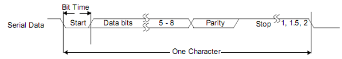
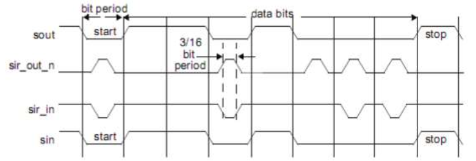
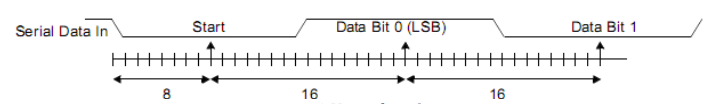
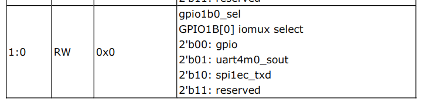

title: [Android7.1][RK3399] UART 调试笔记
date: 2019-5-31 21:00:00
tags: Android7.1

---

## 基础知识
UART （The Universal Asynchronous Receiver/Transmitter）
通用异步收发器用于与外围设备、调制解调器（数据载体设备，DCE）或数据集进行串行通信。
数据从主处理器通过 APB 总线写入UART，并转换成串行形式传输到目的设备。串行数据也由 UART 接收并存储，供主处理器（CPU）回读。
UART 控制器的特性：
* 支持5个独立的通用异步收发器控制器:通用异步收发器0、通用异步收发器1、通用异步收发器2、通用异步收发器3、通用异步收发器4
* 均包含两个用于数据接收和传输的64字节FIFOs
* 通用异步收发器0/通用异步收发器3支持自动流控。
* 支持115.2Kbps、460.8Kbps、921.6Kbps、1.5Mbps、3Mbps、4Mbps的波特率。
* 支持可编程波特率，即使是非整数时钟分频器。
* 标准异步通信位(启动、停止和奇偶校验)
* 支持 基于中断 或 基于DMA 的模式。
* 支持5-8位宽度传输

### 框图
本节提供有关各种条件下的功能和行为的说明。 UART控制器包括：
AMBA APB接口：主处理器通过APB接口访问UART上的数据，控制和状态信息。 UART支持的APB数据总线宽度包括8,16和32位。
先进先出控制器：负责FIFO控制和存储（使用内部RAM时）或信令控制外部RAM（使用时）。
寄存器模块：负责主要的UART功能，包括控制，状态和中断生成。
调制解调器同步模块：同步调制解调器输入信号。
波特时钟生成模块：生成发送器和接收器波特率时钟以及输出参考时钟信号（baudout_n）
串行接收器：将以 UART 或 IrDA 1.0 SIR 格式接收的串行数据字符（由控制寄存器指定）转换为并行格式。 在该块中执行奇偶校验错误检测，帧错误检测和断线检测。
串行发送器：将写入UART 的并行数据转换为串行形式，并添加控制寄存器指定的所有附加位进行传输。 这种串行数据组合（称为字符）可以以两种形式退出块，可以是串行UART格式或IrDA 1.0 SIR格式。

### 功能描述
**UART（RS232）Protocol**
由于串行通信是异步的，因此将额外的位（启动和停止）添加到串行数据以指示开始和结束。 可以向串行字符添加附加的奇偶校验位。 该位出现在字符结构的最后一个数据位之后和停止位之前，以便对接收到的数据执行简单的错误检查，如图所示。


**IrDA 1.0 SIR Protocol**
红外数据协会（IrDA）1.0串行红外（SIR）模式支持使用红外辐射作为传输介质的远程设备的双向数据通信。 IrDA 1.0 SIR模式规定最大波特率为115.2 Kbaud。
发送单个红外脉冲信号为逻辑0，而逻辑1表示不发送脉冲。 每个脉冲的宽度是正常串行位时间的3/16。 启用IrDA SIR模式时，数据传输只能以半双工方式进行。


**Baud Clock**
波特率由串行时钟（单个时钟实现中的sclk或pclk）和除数锁存寄存器（DLH和DLL）控制。 
由于每个位传输的波特率时钟的确切数量是已知的，因此计算采样的中点并不困难，即在起始位之后每16个波特率时钟。


## UART 调试

### DTS 设置问题
我们参考 firefly 这篇文档中的使用方法：
http://wiki.t-firefly.com/zh_CN/Firefly-RK3399/driver_uart.html

```
 uart4: serial@ff370000 {
  compatible = "rockchip,rk3399-uart", "snps,dw-apb-uart";
  reg = <0x0 0xff370000 0x0 0x100>;
  clocks = <&pmucru 6>, <&pmucru 34>;
  clock-names = "baudclk", "apb_pclk";
  interrupts = <0 102 4 0>;
  reg-shift = <2>;
  reg-io-width = <4>;
  pinctrl-names = "default";
  pinctrl-0 = <&uart4_xfer>;
  status = "disabled";
 };
 
 
  uart4 {
   uart4_xfer: uart4-xfer {
    rockchip,pins =
     <1 7 1 &pcfg_pull_up>,
     <1 8 1 &pcfg_pull_none>;
   };
  };

&uart4 {
       current-speed = <115200>;
       no-loopback-test;
       status = "okay";
};

```
由于uart4_rx和uart4_tx两个脚可复用为spi1_rxd和spi1_txd，所以要留意关闭掉spi1的使用，如下：
```
&spidev0 {
	status = "disabled";
};
```
但是在调试过程中，发现仅可以收到数据（RX GPIO1_A7 正常），无法发送数据（TX GPIO1_B0 异常）。

增加 Log:
```
kernel/drivers/pinctrl/pinctrl-rockchip.c
@@ -1202,6 +1202,17 @@ static int rockchip_set_mux(struct rockchip_pin_bank *bank, int pin, int mux)
        dev_dbg(info->dev, "setting mux of GPIO%d-%d to %d\n",
                                                bank->bank_num, pin, mux);
 
+#if 1
+       if ((bank->bank_num == 1) && (pin == 7)) {
+               printk("setting mux of GPIO%d - %d to %d \n", bank->bank_num, pin, mux);
+               dump_stack();
+       }
+       if ((bank->bank_num == 1) && (pin == 8)) {
+               printk("setting mux of GPIO%d - %d to %d \n", bank->bank_num, pin, mux);
+               dump_stack();
+       }
+#endif
+
        regmap = (bank->iomux[iomux_num].type & IOMUX_SOURCE_PMU)
                                ? info->regmap_pmu : info->regmap_base;

```
发现
```
[    0.917454] setting mux of GPIO1 - 7 to 1 
```
GPIO1_A7 被设置为 FUNC1 ，打印了一次，正常。
```
[    0.917787] setting mux of GPIO1 - 8 to 1 
[    1.565105] setting mux of GPIO1 - 8 to 0 
[    1.565105] setting mux of GPIO1 - 8 to 0 
[    1.565105] setting mux of GPIO1 - 8 to 0 

```
GPIO1_B0 在被设置为 FUNC1 后又被设置为 FUNC0。通过 dump_stack() 打印看到是在 i2c_driver_cx20810_probe() 中进行的设置。
```
[    1.565105] setting mux of GPIO1 - 8 to 0 
[    1.565132] CPU: 5 PID: 1 Comm: swapper/0 Not tainted 4.4.103 #4
[    1.565155] Hardware name: Firefly-RK3399 Board mipi (Android) (DT)
[    1.565177] Call trace:
[    1.565214] [<ffffff80080896ac>] dump_backtrace+0x0/0x1cc
[    1.565243] [<ffffff800808988c>] show_stack+0x14/0x1c
[    1.565272] [<ffffff8008381df8>] dump_stack+0x94/0xb4
[    1.565298] [<ffffff80083be688>] rockchip_set_mux+0xf8/0x2dc
[    1.565322] [<ffffff80083bf070>] rockchip_pmx_gpio_set_direction+0x44/0x6c
[    1.565352] [<ffffff80083b9c80>] pinmux_gpio_direction+0x24/0x34
[    1.565378] [<ffffff80083b723c>] pinctrl_gpio_direction+0x70/0xa8
[    1.565404] [<ffffff80083b729c>] pinctrl_gpio_direction_output+0x10/0x18
[    1.565433] [<ffffff80083bc980>] rockchip_gpio_direction_output+0x24/0x30
[    1.565460] [<ffffff80083c0b00>] _gpiod_direction_output_raw+0xcc/0x260
[    1.565486] [<ffffff80083c19f4>] gpiod_direction_output_raw+0x38/0x40
[    1.565512] [<ffffff80083c27d0>] gpio_request_one+0x90/0xd4
[    1.565536] [<ffffff80083bf4ec>] devm_gpio_request_one+0x5c/0x9c
[    1.565567] [<ffffff800888a8a8>] i2c_driver_cx20810_probe+0x1d4/0x3f0
[    1.565596] [<ffffff80086cd5c4>] i2c_device_probe+0x198/0x1d8
[    1.565624] [<ffffff800852e12c>] driver_probe_device+0x118/0x2ac
[    1.565649] [<ffffff800852e324>] __driver_attach+0x64/0x90
[    1.565675] [<ffffff800852d1e0>] bus_for_each_dev+0x80/0xb0
[    1.565699] [<ffffff800852dc70>] driver_attach+0x20/0x28
[    1.565723] [<ffffff800852d828>] bus_add_driver+0xe8/0x1e4
[    1.565749] [<ffffff800852eed8>] driver_register+0x94/0xe0
[    1.565775] [<ffffff80086cdd80>] i2c_register_driver+0x4c/0x74
[    1.565803] [<ffffff8009092e2c>] i2c_driver_cx20810_init+0x18/0x20
[    1.565829] [<ffffff80080831f0>] do_one_initcall+0x178/0x194
[    1.565855] [<ffffff8009050ddc>] kernel_init_freeable+0x1a4/0x25c
[    1.565885] [<ffffff8008b1919c>] kernel_init+0x10/0xf8
[    1.565908] [<ffffff80080828d0>] ret_from_fork+0x10/0x40
```
在 DTS 中进一步查询，发现同事在调试讯飞板子的时候，将 GPIO1_B0 作为 RESET 脚。

修改后正常。

### 测试 App 无法打开问题

使用 Android App “UartDemo” 闪退问题，报错如下：
```
06-10 09:27:15.833  1877  1877 E AndroidRuntime: FATAL EXCEPTION: main
06-10 09:27:15.833  1877  1877 E AndroidRuntime: Process: com.deemons.androidserialport, PID: 1877
06-10 09:27:15.833  1877  1877 E AndroidRuntime: java.lang.RuntimeException: Unable to start activity ComponentInfo{com.deemons.androidserialport/com.deemons.androidserialport.activity.MainActivity}: java.lang.ClassCastException: java.lang.Boolean cannot be cast to java.lang.Integer
06-10 09:27:15.833  1877  1877 E AndroidRuntime: 	at android.app.ActivityThread.performLaunchActivity(ActivityThread.java:2666)
06-10 09:27:15.833  1877  1877 E AndroidRuntime: 	at android.app.ActivityThread.handleLaunchActivity(ActivityThread.java:2727)
06-10 09:27:15.833  1877  1877 E AndroidRuntime: 	at android.app.ActivityThread.-wrap12(ActivityThread.java)
06-10 09:27:15.833  1877  1877 E AndroidRuntime: 	at android.app.ActivityThread$H.handleMessage(ActivityThread.java:1478)
06-10 09:27:15.833  1877  1877 E AndroidRuntime: 	at android.os.Handler.dispatchMessage(Handler.java:102)
06-10 09:27:15.833  1877  1877 E AndroidRuntime: 	at android.os.Looper.loop(Looper.java:154)
06-10 09:27:15.833  1877  1877 E AndroidRuntime: 	at android.app.ActivityThread.main(ActivityThread.java:6121)
06-10 09:27:15.833  1877  1877 E AndroidRuntime: 	at java.lang.reflect.Method.invoke(Native Method)
06-10 09:27:15.833  1877  1877 E AndroidRuntime: 	at com.android.internal.os.ZygoteInit$MethodAndArgsCaller.run(ZygoteInit.java:912)
06-10 09:27:15.833  1877  1877 E AndroidRuntime: 	at com.android.internal.os.ZygoteInit.main(ZygoteInit.java:802)
06-10 09:27:15.833  1877  1877 E AndroidRuntime: Caused by: java.lang.ClassCastException: java.lang.Boolean cannot be cast to java.lang.Integer
06-10 09:27:15.833  1877  1877 E AndroidRuntime: 	at android.app.SharedPreferencesImpl.getInt(SharedPreferencesImpl.java:252)
06-10 09:27:15.833  1877  1877 E AndroidRuntime: 	at com.blankj.utilcode.util.SPUtils.getInt(SPUtils.java:147)
06-10 09:27:15.833  1877  1877 E AndroidRuntime: 	at com.deemons.androidserialport.activity.MainPresenter.<init>(MainPresenter.java:72)
06-10 09:27:15.833  1877  1877 E AndroidRuntime: 	at com.deemons.androidserialport.activity.MainActivity.onCreate(MainActivity.java:65)
06-10 09:27:15.833  1877  1877 E AndroidRuntime: 	at android.app.Activity.performCreate(Activity.java:6709)
06-10 09:27:15.833  1877  1877 E AndroidRuntime: 	at android.app.Instrumentation.callActivityOnCreate(Instrumentation.java:1118)
06-10 09:27:15.833  1877  1877 E AndroidRuntime: 	at android.app.ActivityThread.performLaunchActivity(ActivityThread.java:2619)
06-10 09:27:15.833  1877  1877 E AndroidRuntime: 	... 9 more
```
问题在于没有 ttyS* 的权限，查看权限：
```
rk3399_qxzn_pi_mid:/ # ls -al /dev/ttyS*                                       
crw-rw---- 1 bluetooth net_bt_stack 4,  64 2019-06-10 10:17 /dev/ttyS0
crw-rw---- 1 bluetooth net_bt_stack 4,  65 2019-06-10 10:17 /dev/ttyS1
crw------- 1 root      root         4,  66 2019-06-10 10:17 /dev/ttyS2
crw------- 1 root      root         4,  67 2019-06-10 10:17 /dev/ttyS3
crw-rw-rw- 1 gps       gps          4,  68 2019-06-10 10:17 /dev/ttyS4
```
我们的串口使用的是 ttyS4 ，修改 device/rockchip/common/uevent.rc 或者 ueventd.rockchip.rc
```
device/rockchip/common/ueventd.rockchip.rc
@@ -49,11 +49,13 @@
 /dev/compassirq           0660   system     system
 
 #for GPS u-blox
-/dev/ttyS4                0666   gps        gps
+#/dev/ttyS4                0666   gps        gps
 
 # for GPS
 #/dev/ttyS3                0600   gps        gps
-/dev/gps                  0660   gps        gps
+#/dev/gps                  0660   gps        gps
+
+/dev/ttyS4               0666   system     system
```
修改后编译查看即正常, App 可以正常打开了。
```
crw-rw-rw- 1 system       system          4,  68 2019-06-10 10:22 /dev/ttyS4
```

### IO 命令
比如我要查看 GPIO1_B0 引脚的复用情况。
从主控的datasheet查到GPIO1对应寄存器基地址为：0xff320000
从主控的datasheet查到GPIO1B_IOMUX的偏移量为：0x00014
GPIO1_B0的iomux寄存器地址为：基址(Operational Base) + 偏移量(offset)=0xff320000+0x00014=0xff320014
用以下指令查看GPIO1_B0的复用情况：
```
# io -4 -r 0xff320014
ff320014:  00008168
```
`00008168` 即 `1000 0001 0110 1000`

由上图，`[1:0]`为 `00` ，即代表 `gpio`
所以 dts 中的设置是没有成功的。在查到原因（如之前描述，是讯飞 cx20810 小板的冲突问题）后，disabled cx20810 的 driver 后，
```
# io -4 -r 0xff320014
ff320014:  00008169
```
`00008169` 即 `1000 0001 0110 1001`
由上图，`[1:0]`为 `00` ，即代表`uart4m0_sout`，可以看到设置成功。


### 查看时钟

rk3399_qxzn_pi_mid:/ # cat /sys/kernel/debug/clk/clk_summary | grep uart
    clk_uart3                             0            0    24000000          0 0  
    clk_uart2                             1            1    24000000          0 0  
    clk_uart1                             0            0    24000000          0 0  
    clk_uart0                             1            1    24000000          0 0  
          clk_uart_src                    0            0   800000000          0 0  
             clk_uart3_div                0            0   800000000          0 0  
                clk_uart3_frac            0            0    40000000          0 0  
             clk_uart2_div                0            0   800000000          0 0  
                clk_uart2_frac            0            0    40000000          0 0  
             clk_uart1_div                0            0   800000000          0 0  
                clk_uart1_frac            0            0    40000000          0 0  
          clk_uart0_src                   0            0   800000000          0 0  
             clk_uart0_div                0            0   800000000          0 0  
                clk_uart0_frac            0            0    40000000          0 0  
                   pclk_uart3             0            0    50000000          0 0  
                   pclk_uart2             1            1    50000000          0 0  
                   pclk_uart1             0            0    50000000          0 0  
                   pclk_uart0             1            1    50000000          0 0  
    clk_uart4_pmu                         1            1    24000000          0 0  
          clk_uart4_src                   0            0   676000000          0 0  
             clk_uart4_div                0            0   676000000          0 0  
                clk_uart4_frac            0            0    33800000          0 0  
             pclk_uart4_pmu               1            1    48285715          0 0  

### ts_uart.bin 串口调试工具
Use the following format to run the HS‐UART TEST PROGRAM：**ts_uart v1.0**
For sending data:
```
./ts_uart <tx_rx(s/r)> <file_name> <baudrate> <flow_control(0/1)> <max_delay(0‐100)> <random_size(0/1)> /dev/ttyS[n]
```
tx_rx : send data from file (s) or receive data (r) to put in file
file_name : file name to send data from or place data in
baudrate : baud rate used for TX/RX
flow_control : enables (1) or disables (0) Hardware flow control using RTS/CTS lines
max_delay : defines delay in seconds between each data burst when sending. Choose 0 for
continuous stream.
random_size : enables (1) or disables (0) random size data bursts when sending. Choose 0
for max size.
max_delay and random_size are useful for sleep/wakeup over UART testing. ONLY meaningful
when sending data
Examples:
Sending data (no delays)
ts_uart s init.rc 1500000 0 0 0 /dev/ttyS0
loop back mode:
ts_uart m init.rc 1500000 0 0 0 /dev/ttyS0
receive then send
ts_uart r init.rc 1500000 0 0 0 /dev/ttyS0

发送举例：
```
ts_uart s /sdcard/test 115200 0 0 0 /dev/ttyS4
```