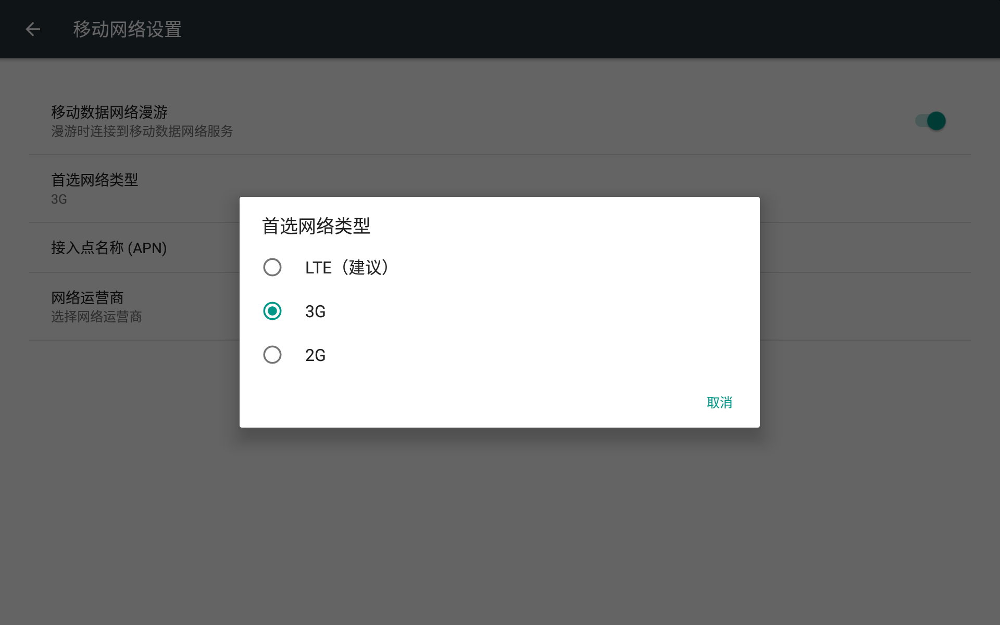

Platform: RK3399
OS: Android 7.1
Kernel: v4.4.126

## 需求
将设置首选网络类型由3G设置为LTE


## 设置步骤

```
diff --git a/rk3399_mid_pi/system.prop b/r`k3399_mid_pi/system.prop
index 7afd10d..0f28e70 100755
--- a/rk3399_mid_pi/system.prop
+++ b/rk3399_mid_pi/system.prop
@@ -38,3 +38,6 @@ wifi.supplicant_scan_interval=15
 ro.factory.tool=0
 #set default lcd density for rk3399 tablet
 ro.sf.lcd_density=280
+
+#set default network mode
+#（NETWORK_MODE_LTE_TDSCDMA_CDMA_EVDO_GSM_WCDMA）
+ro.telephony.default_network=22
```

## 源码路径
frameworks/base/telephony/java/com/android/internal/telephony/RILConstants.java
```
/* NETWORK_MODE_* See ril.h RIL_REQUEST_SET_PREFERRED_NETWORK_TYPE */
int NETWORK_MODE_WCDMA_PREF     = 0; /* GSM/WCDMA (WCDMA preferred) */
int NETWORK_MODE_GSM_ONLY       = 1; /* GSM only */
int NETWORK_MODE_WCDMA_ONLY     = 2; /* WCDMA only */
int NETWORK_MODE_GSM_UMTS       = 3; /* GSM/WCDMA (auto mode, according to PRL)
                                        AVAILABLE Application Settings menu*/
int NETWORK_MODE_CDMA           = 4; /* CDMA and EvDo (auto mode, according to PRL)
                                        AVAILABLE Application Settings menu*/
int NETWORK_MODE_CDMA_NO_EVDO   = 5; /* CDMA only */
int NETWORK_MODE_EVDO_NO_CDMA   = 6; /* EvDo only */
int NETWORK_MODE_GLOBAL         = 7; /* GSM/WCDMA, CDMA, and EvDo (auto mode, according to PRL)
                                        AVAILABLE Application Settings menu*/
int NETWORK_MODE_LTE_CDMA_EVDO  = 8; /* LTE, CDMA and EvDo */
int NETWORK_MODE_LTE_GSM_WCDMA  = 9; /* LTE, GSM/WCDMA */
int NETWORK_MODE_LTE_CMDA_EVDO_GSM_WCDMA = 10; /* LTE, CDMA, EvDo, GSM/WCDMA */
int NETWORK_MODE_LTE_ONLY       = 11; /* LTE Only mode. */
int NETWORK_MODE_LTE_WCDMA      = 12; /* LTE/WCDMA */
int NETWORK_MODE_TD_SCDMA_ONLY            = 13; /* TD-SCDMA only */
int NETWORK_MODE_TD_SCDMA_WCDMA           = 14; /* TD-SCDMA and WCDMA */
int NETWORK_MODE_TD_SCDMA_LTE             = 15; /* TD-SCDMA and LTE */
int NETWORK_MODE_TD_SCDMA_GSM             = 16; /* TD-SCDMA and GSM */
int NETWORK_MODE_TD_SCDMA_GSM_LTE         = 17; /* TD-SCDMA,GSM and LTE */
int NETWORK_MODE_TD_SCDMA_GSM_WCDMA       = 18; /* TD-SCDMA, GSM/WCDMA */
int NETWORK_MODE_TD_SCDMA_WCDMA_LTE       = 19; /* TD-SCDMA, WCDMA and LTE */
int NETWORK_MODE_TD_SCDMA_GSM_WCDMA_LTE   = 20; /* TD-SCDMA, GSM/WCDMA and LTE */
int NETWORK_MODE_TD_SCDMA_CDMA_EVDO_GSM_WCDMA  = 21; /*TD-SCDMA,EvDo,CDMA,GSM/WCDMA*/
int NETWORK_MODE_TD_SCDMA_LTE_CDMA_EVDO_GSM_WCDMA = 22; /* TD-SCDMA/LTE/GSM/WCDMA, CDMA, and
```

frameworks/base/packages/SettingsProvider/src/com/android/providers/settings/DatabaseHelper.java
```
// Set the preferred network mode
int defaultNetworkType = RILConstants.PREFERRED_NETWORK_MODE;
int numPhones = MSimTelephonyManager.getDefault().getPhoneCount();
String networkMode = SystemProperties.get("ro.telephony.default_network");
if (networkMode != null) {
    if (numPhones == MSimConstants.MAX_PHONE_COUNT_SINGLE_SIM) {
        loadSetting(
                stmt,
                Settings.Global.PREFERRED_NETWORK_MODE,
                MSimTelephonyManager.getTelephonyProperty(
                        "ro.telephony.default_network", 0,
                        Integer.toString(defaultNetworkType)));
    } else {
        loadSetting(stmt, Settings.Global.PREFERRED_NETWORK_MODE, networkMode);
                }
} else {
                StringBuilder sb = new StringBuilder(defaultNetworkType);
    for (int i = 0; i < numPhones - 1; i++) {
        sb.append(",");
       sb.append(RILConstants.NETWORK_MODE_GSM_ONLY);
    }
    loadSetting(stmt, Settings.Global.PREFERRED_NETWORK_MODE, sb.toString());

```
