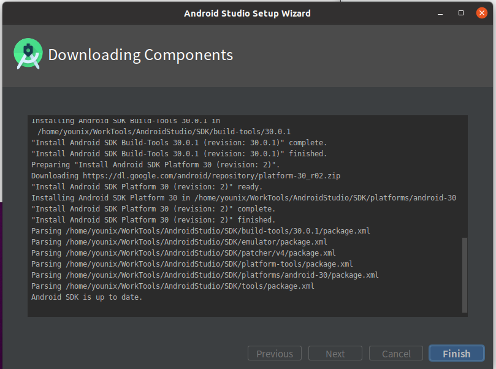
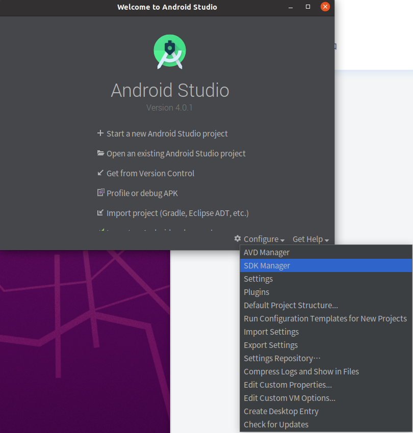
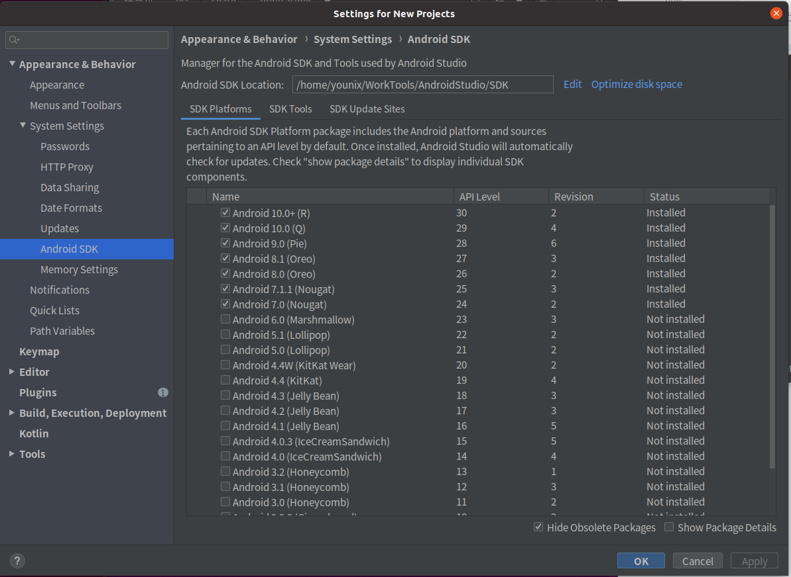

title: Ubuntu20.04 环境搭建—Android App 和 SDK 开发环境搭建
date: 2020-7-17 21:00:00
tags: Ubuntu,Android

---

如果内容对你有帮助，欢迎评论让我知道 ：）
Ubuntu20.04 的环境搭建分为三部分
1. 基础使用篇（源、输入法、浏览器、微信、QQ、OneNote）
2. Android 开发环境篇（AndroidStudio，AOSP 编译环境）
3. ROS 开发环境篇（TX2、CUDA）


[TOC]

## Android App 开发环境搭建
### 安装 AndroidStudio
https://developer.android.google.cn/studio?hl=zh-cn
我这里下的是 4.0.1 版本的 AndroidStudio
```
tar zxvf android-studio-ide-193.6626763-linux.tar.gz
./android-studio/bin/studio.sh
```
最开始会碰到设置代理，选择 cancel 即可。（因为在上一节里面，我们已经用 clash 设置好了全局）
然后一步步安装sdk即可。


接下来安装不同版本的 SDK


挑自己常用的下载



然后将 AS 的图标添加到左边的 Launcher 上。在Ubuntu20.04叫做“收藏夹”
参考这篇：https://blog.csdn.net/u012169524/article/details/51541563


## Android SDK（AOSP）开发环境搭建
### 安装 openJDK 和工具
```
## Java JDK
sudo apt-get install openjdk-8-jdk
## 编译工具
sudo apt-get install m4
sudo apt-get install  g++-multilib gcc-multilib lib32ncurses5-dev lib32readline6-dev lib32z1-dev
sudo apt-get install flex
sudo apt-get install curl
sudo apt-get install bison
```

### 编译 Android 7.1

```
[  0% 21/50505] Lex: aidl <= system/tools/aidl/aidl_language_l.ll
FAILED: /bin/bash -c "prebuilts/misc/linux-x86/flex/flex-2.5.39 -oout/host/linux-x86/obj/STATIC_LIBRARIES/libaidl-common_intermediates/aidl_language_l.cpp system/tools/aidl/aidl_language_l.ll"
flex-2.5.39: loadlocale.c:130:_nl_intern_locale_data: ?? 'cnt < (sizeof (_nl_value_type_LC_TIME) / sizeof (_nl_value_type_LC_TIME[0]))' ???
Aborted (core dumped)
```
参考：https://stackoverflow.com/questions/49301627/android-7-1-2-armv7
解决方案：
```
export LC_ALL=C
```