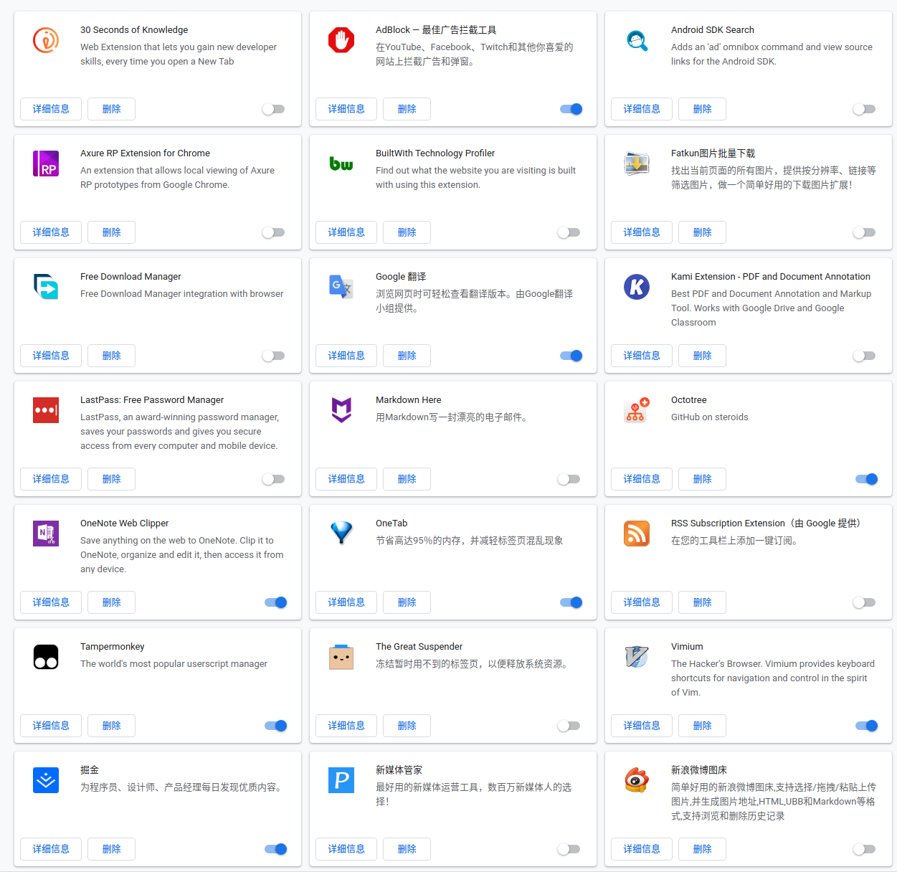
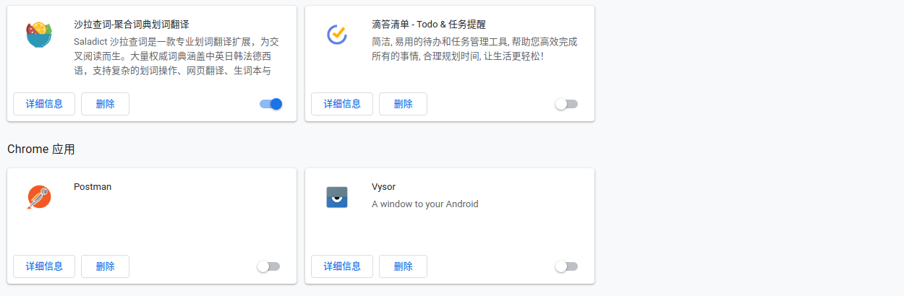
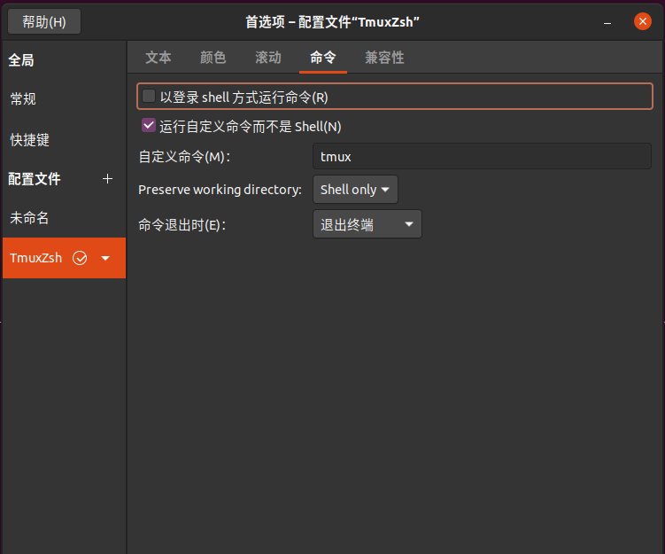

title: Ubuntu20.04 环境搭建—基础使用篇（源、输入法、浏览器、微信、QQ、OneNote）
date: 2020-7-16 21:00:00
tags: Ubuntu

---

如果内容对你有帮助，欢迎评论让我知道 ：）

Ubuntu20.04 的环境搭建分为三部分
1. 基础使用篇（源、输入法、浏览器、微信、QQ、OneNote）
2. Android 开发环境篇（AndroidStudio，AOSP 编译环境）
3. ROS 开发环境篇（TX2、CUDA）

这篇文章是针对于之前有过 Linux 使用基础的同学，所以大部分会是资料的链接。简单的步骤都会省略，有问题放在评论区，其他的小伙伴知道的会热情的解答的～
本文会随着使用过程一直更新，欢迎关注收藏。

[TOC]

### Ubuntu 20.04 source.list 换为国内源
清华源 阿里源 中科大源 163源 zuozhe:nudt_qxx 
https://blog.csdn.net/xiangxianghehe/article/details/105688062 
原始网站: https://mirror.tuna.tsinghua.edu.cn/help/ubuntu/

### 所有软件更新到最新
```
sudo apt update
sudo apt upgrade
```
我更新过程中碰到了黑屏，通过 ctrl + alt + F1 进入命令行模式 reboot 重启后解决
看 log 发现是 initramfs-tools 安装的时候有报错。解决方法如下：
ubuntu dpkg initramfs-tools 错误的解决方法  作者: Ciruy B.Heimerdinger 
https://blog.csdn.net/qq_31433709/article/details/100982898
原始网站:https://ubuntuforums.org/showthread.php?t=1990236

### 解决VIM的使用小Bug-上下左右变成ABCD的问题
https://blog.csdn.net/ztl0013/article/details/53695347

### Ubuntu20.04安装搜狗输入法的详细步骤
https://www.jb51.net/article/186808.htm
搜狗官网地址：https://pinyin.sogou.com/linux/?r=pinyin

### 安装 chrome 浏览器
官方下载地址：https://www.google.cn/chrome/
安装方法：
```
sudo dpkg -i google-chrome-stable_current_amd64.deb 
```

### 修改hosts以加速github访问速度
https://blog.csdn.net/weixin_43235209/article/details/104617827
修改完后重启网卡
```
sudo /etc/init.d/network-manager restart
```
### 安装某工具科学爬坡 你懂的
这里一直审核不通过，所以去掉了，只留下Github的网址，大家自己看吧
看 CPU 架构
```
$ dpkg --print-architecture
amd64
```
到 github 下载对应的 release 版本：https://github.com/Dreamacro/

### 设置开机自动启动
网上添加脚本的步骤都过于复杂，而且不好管控。
直接使用现成的工具即可。
我最喜欢的是 cinnamon 桌面系统下的附带的工具。
```
sudo apt install cinnamon
```
安装完毕后
```
cinnamon-settings startup
```


### 登录 Google 账户
浏览器登录 Google 账户，开启同步功能，舒服了，现在，一半的开发环境已经搭建好了。哈哈。
分享一下我主要在用的插件。


### 登录 Google 账户
浏览器登录 Google 账户，开启同步功能，舒服了，现在，一半的开发环境已经搭建好了。哈哈。
分享一下我主要在用的插件。



### 基本工具 curl 、git、tree
```
sudo apt install curl git tree
```
curl 下载工具
git 版本管理工具

### 安装终端神器 tmux zsh 和 oh-my-zsh
tmux 终端复用神器 阮一峰大大的介绍：https://www.ruanyifeng.com/blog/2019/10/tmux.html
zsh 比bash更爽的shell，配合 oh-my-zsh 简直爽爆

每个工程师都必须要使用的终端插件！极高的提高工作效率。
https://ohmyz.sh/
```
sudo apt install zsh tmux
sh -c "$(curl -fsSL http://raw.github.com/ohmyzsh/ohmyzsh/master/tools/install.sh)"
```
这里可能会碰到 `curl: (7) Failed to connect to raw.github.com port 443: 拒绝连接`
的问题。
是梯子导致的，去 clash.razord.top 的配置里面将其改为全局。

设置一下 tmux 的默认 shell 为 zsh
```
vi ~/.tmux.conf
# 编辑里面的内容为
set -g default-shell /bin/zsh
set -g default-command /bin/zsh
```
关闭终端，再进 输入tmux ，先按C+b，然后输入“:”
此时已经进入命令行模式，在命令行输入：source-file ~/.tmux.conf

在终端首选项中修改一下，让 Ctrl+Alt+T打开终端的时候tmux都是开的



### 安装微信和QQ
参考 https://www.cnblogs.com/gamesun/p/12228299.html
使用 deepin 开发的 wechat，当然 qq 也是有的。不过我只需要微信。
两条命令：
```
# 安装 deepin-wine  # 深度是家好公司
wget -O- https://deepin-wine.i-m.dev/setup.sh | sh
# 安装微信
sudo apt-get install deepin.com.wechat
# 安装 QQ
sudo apt-get install deepin.com.qq.im
```

### 安装 OneNote
OneNote 曾经是我在windows平台唯一无法割舍的软件。
现在终于可以在 Linux 平台使用他了！泪目。感谢
Github 地址：https://github.com/patrikx3/onenote/releases/
你可以直接下载 P3X-OneNote-2020.10.105-arm64.AppImage
也可以使用 npm 安装
```
sudo apt install npm
npm install p3x-onenote
```
如果你安装过程中可能出现了 RequestError: connect ETIMEDOUT 52.216.80.144:443
之类的问题，请把梯子的规则设置为全局。

另一个方法：
```
$ sudo snap install p3x-onenote
Download snap "p3x-onenote" (77) from channel "stable" 
```

### 安装网易云音乐 @2020.07.17
网易云官方下载https://music.163.com/#/download
是针对 ubuntu18.04的，但是20.04也可以用
```
sudo dpkg -i netease-cloud-music_1.2.1_amd64_ubuntu_20190428.deb
```

---

基础使用环境搭建完了，如果对你有帮助，请点赞评论，ThankU～