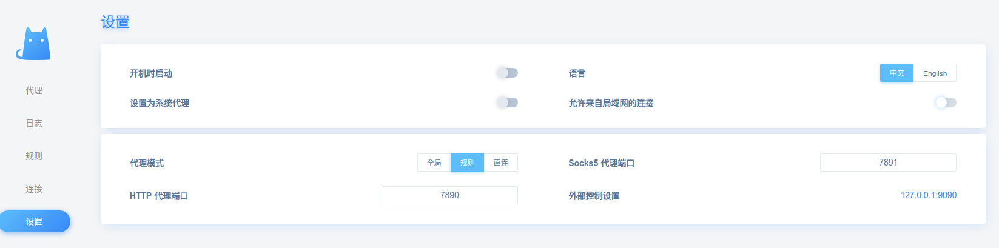
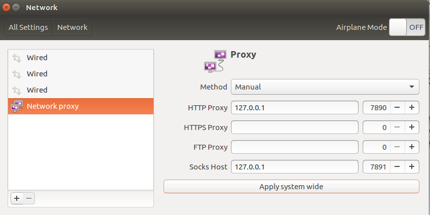

title: Ubuntu16.04 使用 Clash v0.20.0
date: 2020-5-18 21:00:00
tags: Ubuntu16.04

---

## 需求
利用 Clash 使用 V2Ray 科学上网。

## 步骤
`https://github.com/Dreamacro/clash/releases`
选择适合自己电脑的版本下载。
比如 clash-linux-amd64-2020.05.08.gz
```
cd ~/Downloads/
mkdir clash
mv clash-linux-amd64-2020.05.08.gz clash/
cd clash
gunzip clash-linux-amd64-2020.05.08.gz
# 解压出来的文件名为 clash-linux-amd64-2020.05.08
# 为其增加可执行权限
chmod +x ./clash-linux-amd64-2020.05.08
./clash-linux-amd64-2020.05.08
```
碰到第一个问题 找不到 MMDB
```
$ ./clash-linux-amd64-2020.05.08 
INFO[0000] Can't find config, create a initial config file 
INFO[0000] Can't find MMDB, start download              
FATA[0000] Initial configuration directory error: Can't initial MMDB: Can't download MMDB: Get "https://github.com/Dreamacro/maxmind-geoip/releases/latest/download/Country.mmdb": proxyconnect tcp: dial tcp 127.0.0.1:1080: connect: connection refused 
```
手动去 `https://github.com/Dreamacro/maxmind-geoip/releases/latest/download/Country.mmdb`
进行下载。
```
cd ~/Downloads/
cp Country.mmdb ~/.config/clash/
```
重新执行
```
./clash-linux-amd64-2020.05.08
INFO[0000] HTTP proxy listening at: 127.0.0.1:7890      
```
卡在这里就对了。接下来配置 yaml 文件。

你的服务商一般会提供 “客户端订阅链接”这样的连接。
下载下来后是一个 yaml 的文件，将里面的内容完全复制到 
`~/.config/clash/Clash.yaml` 中。
```
cd ~/Downloads/
mv xxx.yml ~/.config/clash/Clash.yaml
```
重新执行
```
$ ./clash-linux-amd64-2020.05.08 
[sudo] password for younix: 
INFO[0000] Start initial compatible provider xxx
INFO[0000] SOCKS proxy listening at: 127.0.0.1:7891
INFO[0000] Redir proxy listening at: 127.0.0.1:7892
INFO[0000] HTTP proxy listening at: 127.0.0.1:7890  
```
登录 `http://clash.razord.top` 进行clash策略组设置
设置中，按照 yaml 中进行配置：

代理中，选择自己的节点。
规则中，设定科学的上网规则，比如哪些需要科学，哪些不需要

最后一步，系统设置 Network — Network proxy ，Method 选择 Manual ：

其中的信息也是按照 yaml 的文件填写。

自此，可以正常上网了，舒服。