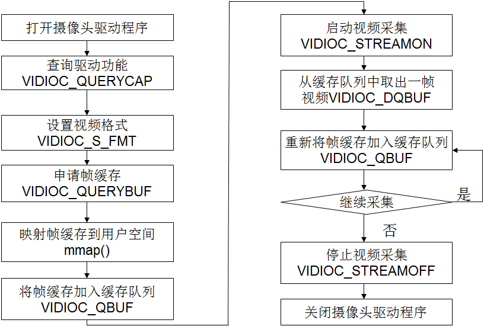
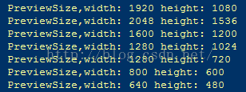

Hardware:MT6737
DeviceOS:Android6.0
Kernel: Linux3.18
HostOS: Ubuntu16.04


## 基础知识
USB video class（又称为USB video device class or UVC）就是USB device class视频产品在不需要安装任何的驱动程序下即插即用，包括摄像头、数字摄影机、模拟视频转换器、电视卡及静态视频相机。
Linux内核之中，已经集成了对UVCCamre的支持。

### V4L2 
Video4Linux或V4L是一个视频截取及设备输出API，以及Linux的驱动程序框架，支持很多USB摄像头、电视调谐卡以及其他设备。
简单的讲V4L2就是用来管理UVC设备的并且能够提供视频相关的一些API。那么这些API怎么使用或者能被谁使用呢。在Linux系统上有很多的开源软件能够支持V4L2。常见的又FFmpeg、opencv、Skype、Mplayer等等。


## 移植步骤
### 内核部分
对于 MTK 平台，本身是不支持 UVC Camera 的。但是 Linux 源码中是有进行支持的，所以我们进行相应的修改：

1. 对于 Kernel 若需要打开UVC CAMERA 需要在内核中配置：
CONFIG_MEDIA_SUPPORT=y
CONFIG_MEDIA_CAMERA_SUPPORT=y
CONFIG_VIDEO_DEV=y
CONFIG_VIDEO_V4L2=y
CONFIG_VIDEOBUF2_CORE=y
CONFIG_VIDEOBUF2_MEMOPS=y
CONFIG_VIDEOBUF2_VMALLOC=y
CONFIG_MEDIA_USB_SUPPORT=y
CONFIG_USB_VIDEO_CLASS=y
USB_VIDEO_CLASS_INPUT_EVDEV = y

OTG 相关的配置：
CONFIG_USB_MTK_OTG=y 
CONFIG_USB_MTK_HDRC=y 
CONFIG_USB_MTK_HDRC_HCD=y

权限问题：
本以为添加了/dev/video0    0666   root    root就可以了，但是，有时候video0会变成video1，第一次打开SimpleWebCam.apk软件的时候，图像正常，之后再次进入SimpleWebCam.apk，就没有图像了。查看了日志信息，显示没有找到设备。在查看root@<project>:/dev #，dev/video0变成了dev/video1！USB摄像头并没有换，为什么会显示dev/video1。修改了SimpleWebCam.apk，使其支持video0~video3，但是日志输出E/WebCam  ( 3352): Cannot open '/dev/video1': 13,Permission denied，于是我们的解决方法如下：
system/core/rootdir/ueventd.rc 下添加：
/dev/video0    0666   root    root
/dev/video1    0666   root    root
/dev/video2    0666   root    root
/dev/video3    0666   root    root

安全策略：
如果 SeLinux 没有关闭，还需要在 system_app.te 进行如下修改。
```
allow system_app video_device:chr_file { read write open getattr };
```

## 应用层部分
v4l2 - Video for Linux 2，是Linux内核中关于视频设备的内核驱动框架，为上层的访问底层的视频设备提供了统一的接口。同时是针对uvc免驱usb设备的编程框架，主要用于采集 usb 摄像头等。

### 操作方式
在v4l2编程中，一般使用ioctl函数来对设备进行操作：
```
extern int ioctl (int __fd, unsigned long int __request, …) __THROW;
```
`__fd`：设备的ID，例如用open函数打开/dev/video0后返回的cameraFd； 
`__request`：具体的命令标志符。 

在进行V4L2开发中，一般会用到以下的命令标志符： 
VIDIOC_REQBUFS：分配内存 
VIDIOC_QUERYBUF：把VIDIOC_REQBUFS中分配的数据缓存转换成物理地址 
VIDIOC_QUERYCAP：查询驱动功能 
VIDIOC_ENUM_FMT：获取当前驱动支持的视频格式 
VIDIOC_S_FMT：设置当前驱动的视频格式 
VIDIOC_G_FMT：读取当前驱动的视频格式 
VIDIOC_TRY_FMT：验证当前驱动的视频格式 
VIDIOC_CROPCAP：查询驱动的修剪能力 
VIDIOC_S_CROP：设置视频信号的边框 
VIDIOC_G_CROP：读取视频信号的边框 
VIDIOC_QBUF：把数据放回缓存队列 
VIDIOC_DQBUF：把数据从缓存中读取出来 
VIDIOC_STREAMON：开始视频采集 
VIDIOC_STREAMOFF：结束视频采集 
VIDIOC_QUERYSTD：检查当前视频设备支持的标准，例如PAL或NTSC。 
这些IO调用，有些是必须的，有些是可选择的。

在网上有开源的应用simplewebcam，它已经实现了基本的v4l2视频采集流程。大概看下它是怎么做的

### 操作流程

http://www.hep.by/gnu/kernel/usb/usbfs-ioctl.html



### 代码实现
#### 1. 打开设备驱动节点
```
int opendevice(int i)
{
    struct stat st;

    sprintf(dev_name,"/dev/video%d",i);

    if (-1 == stat (dev_name, &st)) {
        LOGE("Cannot identify '%s': %d, %s", dev_name, errno, strerror (errno));
        return ERROR_LOCAL;
    }

    if (!S_ISCHR (st.st_mode)) {
        LOGE("%s is no device", dev_name);
        return ERROR_LOCAL;
    }

    fd = open (dev_name, O_RDWR);

    if (-1 == fd) {
        LOGE("Cannot open '%s': %d, %s", dev_name, errno, strerror (errno));
        return ERROR_LOCAL;
    }
    return SUCCESS_LOCAL;
}
```
#### 2. 查询驱动功能
```
int initdevice(void) 
{
    struct v4l2_capability cap;
    struct v4l2_format fmt;
    unsigned int min;

    if (-1 == xioctl (fd, VIDIOC_QUERYCAP, &cap)) {
        if (EINVAL == errno) {
            LOGE("%s is no V4L2 device", dev_name);
            return ERROR_LOCAL;
        } else {
            return errnoexit ("VIDIOC_QUERYCAP");
        }
    }

    if (!(cap.capabilities & V4L2_CAP_VIDEO_CAPTURE)) {
        LOGE("%s is no video capture device", dev_name);
        return ERROR_LOCAL;
    }

    if (!(cap.capabilities & V4L2_CAP_STREAMING)) {
        LOGE("%s does not support streaming i/o", dev_name);
        return ERROR_LOCAL;
    }

    ......

}
```
#### 3. 设置视频格式
```
int initdevice(void) 
{
    struct v4l2_capability cap;
    struct v4l2_format fmt;

    ......

    CLEAR (fmt);
    fmt.type                = ;
    fmt.fmt.pix.width       = IMG_WIDTH; 
    fmt.fmt.pix.height      = IMG_HEIGHT;
    fmt.fmt.pix.pixelformat = V4L2_PIX_FMT_MJPEG;

    if (-1 == xioctl (fd, VIDIOC_S_FMT, &fmt))
        return errnoexit ("VIDIOC_S_FMT");

    ......
}
```
#### 4. 申请帧缓存并映射到用户空间
```
int initmmap(void)
{
    struct v4l2_requestbuffers req;

    CLEAR (req);
    req.count               = 4;
    req.type                = ;
    req.memory              = V4L2_MEMORY_MMAP;

    if (-1 == xioctl (fd, VIDIOC_REQBUFS, &req)) {
        if (EINVAL == errno) {
            LOGE("%s does not support memory mapping", dev_name);
            return ERROR_LOCAL;
        } else {
            return errnoexit ("VIDIOC_REQBUFS");
        }
    }

    if (req.count < 2) {
        LOGE("Insufficient buffer memory on %s", dev_name);
        return ERROR_LOCAL;
    }

    buffers = calloc (req.count, sizeof (*buffers));

    if (!buffers) {
        LOGE("Out of memory");
        return ERROR_LOCAL;
    }

    for (n_buffers = 0; n_buffers < req.count; ++n_buffers) {
        struct v4l2_buffer buf;

        CLEAR (buf);
        buf.type        = V4L2_BUF_TYPE_VIDEO_CAPTURE;
        buf.memory      = V4L2_MEMORY_MMAP;
        buf.index       = n_buffers;

        if (-1 == xioctl (fd, VIDIOC_QUERYBUF, &buf))
            return errnoexit ("VIDIOC_QUERYBUF");

        buffers[n_buffers].length = buf.length;
        buffers[n_buffers].start =
        mmap (NULL ,
            buf.length,
            PROT_READ | PROT_WRITE,
            MAP_SHARED,
            fd, buf.m.offset);

        if (MAP_FAILED == buffers[n_buffers].start)
            return errnoexit ("mmap");
    }

    return SUCCESS_LOCAL;
}
```
#### 需要注意的点


## 调试步骤

1. 通过 lsusb 命令，找到当前 UVC Camera 的 PID 和 VID
```
root@br6737m_65_s_m0:/ # lsusb
Bus 001 Device 007: ID 058f:5608
Bus 001 Device 001: ID 1d6b:0002

```

2. 查看摄像头设备节点是否有生成：
```
root@br6737m_65_s_m0:/ # /dev/video*
/dev/video0
```

3. 查看摄像头驱动信息：
如果摄像头枚举成功，会输出如下信息：
```
root@br6737m_65_s_m0:/ # cat /sys/kernel/debug/usb/devices

T:  Bus=01 Lev=01 Prnt=01 Port=00 Cnt=01 Dev#=  7 Spd=480  MxCh= 0
D:  Ver= 2.00 Cls=ef(misc ) Sub=02 Prot=01 MxPS=64 #Cfgs=  1
P:  Vendor=058f ProdID=5608 Rev= 0.03
S:  Manufacturer=Alcor Micro, Corp.
S:  Product=USB 2.0 Camera
C:* #Ifs= 2 Cfg#= 1 Atr=80 MxPwr=200mA
A:  FirstIf#= 0 IfCount= 2 Cls=0e(video) Sub=03 Prot=00
I:* If#= 0 Alt= 0 #EPs= 1 Cls=0e(video) Sub=01 Prot=00 Driver=uvcvideo
E:  Ad=82(I) Atr=03(Int.) MxPS=  16 Ivl=2048ms
I:* If#= 1 Alt= 0 #EPs= 0 Cls=0e(video) Sub=02 Prot=00 Driver=uvcvideo
I:  If#= 1 Alt= 1 #EPs= 1 Cls=0e(video) Sub=02 Prot=00 Driver=uvcvideo
E:  Ad=81(I) Atr=05(Isoc) MxPS=3072 Ivl=125us
I:  If#= 1 Alt= 2 #EPs= 1 Cls=0e(video) Sub=02 Prot=00 Driver=uvcvideo
E:  Ad=81(I) Atr=05(Isoc) MxPS=3072 Ivl=125us
I:  If#= 1 Alt= 3 #EPs= 1 Cls=0e(video) Sub=02 Prot=00 Driver=uvcvideo
E:  Ad=81(I) Atr=05(Isoc) MxPS=3072 Ivl=125us
```
4. 查看是否遵循 UVC 协议：
```
lsusb -d 058f:5608 -v | grep "14 Video"
Couldn't open device, some information will be missing
      bFunctionClass         14 Video
      bInterfaceClass        14 Video
      bInterfaceClass        14 Video
      bInterfaceClass        14 Video
      bInterfaceClass        14 Video
      bInterfaceClass        14 Video
```

5. 打开/关闭linux uvc driver log

6. sudo echo 0xffff > /sys/module/uvcvideo/parameters/trace    打开
sudo echo 0 > /sys/module/uvcvideo/parameters/trace    关闭

7. 利用测试 App 进行测试。


## 问题汇总

1.手机没有对应摄像头，例如手机可能只有两个摄像头，下标从0开始，Camera.open(2)打开的是第3个摄像头就会出问题
```
private void openCamera(int cameraFacing) throws RuntimeException {  
    releaseCamera();  
    Camera.CameraInfo info = new Camera.CameraInfo();  
    for (int i = 0; i < Camera.getNumberOfCameras(); i++) {  
        Camera.getCameraInfo(i, info);  
        if (info.facing == cameraFacing) {  
            mCamera = Camera.open(i); // 打开对应的摄像头，获取到camera实例  
            mIsOpened = true;  
            return;  
        }  
    }  
}  
```
2.应用没有对应权限或者对应权限没有打开。
在 AndroidManifest.xml 加上对应权限
```
<uses-permission android:name="android.permission.CAMERA" />
```
再检查你的应用对应的权限是否打开
3.代码中使用了手机不支持的预览尺寸
可以通过如下代码查看你的手机支持的预览尺寸有哪些（不同手机支持的预览大小不一样）

```
List<Size> previewSizes = mCamera.getParameters().getSupportedPreviewSizes();  
for (int i = 0; i < previewSizes.size(); i++) {  
Size psize = previewSizes.get(i);  
Log.i(TAG + "initCamera", "PreviewSize,width: " + psize.width + " height: " + psize.height);  
}  
```
之后查看log就可以看到了



4. 将 USB Camera 插到电脑上，显示如下信息：
```
[810715.631151] usb 1-9: new high-speed USB device number 102 using xhci_hcd
[810716.055509] usb 1-9: New USB device found, idVendor=058f, idProduct=5608
[810716.055513] usb 1-9: New USB device strings: Mfr=3, Product=1, SerialNumber=0
[810716.055516] usb 1-9: Product: USB 2.0 Camera
[810716.055519] usb 1-9: Manufacturer: Alcor Micro, Corp.
[810716.070201] uvcvideo: Found UVC 1.00 device USB 2.0 Camera (058f:5608)
[810716.072748] uvcvideo 1-9:1.0: Entity type for entity Extension 6 was not initialized!
[810716.072750] uvcvideo 1-9:1.0: Entity type for entity Processing 5 was not initialized!
[810716.072751] uvcvideo 1-9:1.0: Entity type for entity Selector 4 was not initialized!
[810716.072752] uvcvideo 1-9:1.0: Entity type for entity Camera 1 was not initialized!
[810716.072854] input: USB 2.0 Camera: USB 2.0 Camera as /devices/pci0000:00/0000:00:14.0/usb1/1-9/1-9:1.0/input/input31
[810751.767560] usb 1-9: USB disconnect, device number 102
```

5. MTK 平台默认不支持 YUV 格式的 UVC, 仅支持 MJPEG 格式的 Camera.
而且因为 USB ISO 优化做的不够好的原因, 仅仅只能支持 1-2 帧的数据传输.
需要合入 USB 2.0 相关的 Patch 才能流畅的(30帧)支持 MJPEG 格式的 UVC camera.


## 参考

**Android USB Camera(1) : 调试记录**: https://blog.csdn.net/eternity9255/article/details/53069037

https://www.cnblogs.com/sky-heaven/p/7209590.html
http://bbs.raindi.net/thread-9866-1-1.html
https://blog.csdn.net/eternity9255/article/details/53069037
https://blog.csdn.net/king_jie0210/article/details/71106720
https://blog.csdn.net/panp85/article/details/51087693
https://blog.csdn.net/orz415678659/article/details/10022993

