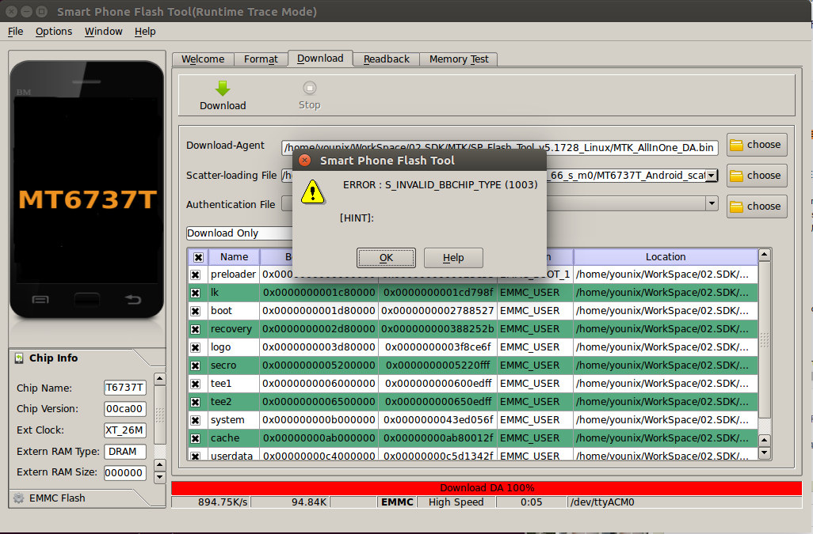

## 编译问题

### art 报错
修改  alps/art/build/android.common_build.mk 大概81行
```
#ifneq ($(WITHOUT_HOST_CLANG),true)
ifeq ($(WITHOUT_HOST_CLANG),false)
```

### libcam 无法编译的问题
错误信息：
```
make: *** No rule to make target 'out/target/product/br6737m_65_s_m0/obj_arm/STATIC_LIBRARIES/libcam.halmemory_intermediates/export_includes', needed by 'out/target/product/br6737m_65_s_m0/obj_arm/SHARED_LIBRARIES/libcam_platform_intermediates/import_includes'.  Stop
```
解决方法：
```
aiiage@repo:~/alps$ cp -a vendor/mediatek/proprietary/hardware/mtkcam/legacy/platform/mt6735m/hal/memory vendor/mediatek/proprietary/hardware/mtkcam/legacy/platform/mt6735m/entry/
```

### S_BROM_CMD_JUMP_DA_FAIL
是由于 Ubuntu14.04 / 16.04 环境问题。


 是由于modemmanager包在ubuntu 14.04 或是更高版本中对于MTK的Flash 工具支持不完全，所造成的，如果想使用MTK的Flash工具，就要卸载这个包 
```
sudo apt-get remove modemmanager    //卸载modemmanager包
sudo service udev restart       //从启udev

# 卸载这个服务之后可能会造成内核模块　cdc_acm　不可用．执行以下命令进行检查
lsmod | grep cdc_acm            //检查    

# 执行后出现：
	cdc_acm                36864  0     //表示可用

# 如果没有任何输出：
	sudo modprobe cdc_acm           //智能安装cdc_acm

ok
```
如果出现pmt changed for the rom; it must be downloaded这个错误，则选择固件升级，便可以下载。


### S_INVALID_BBCHIP_TYPE
芯片类型不匹配
